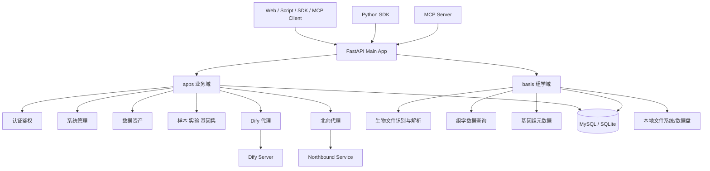
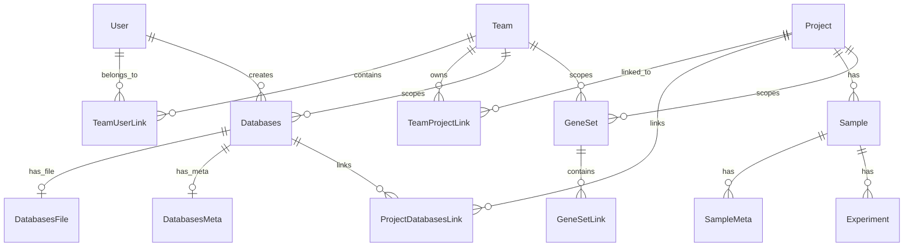
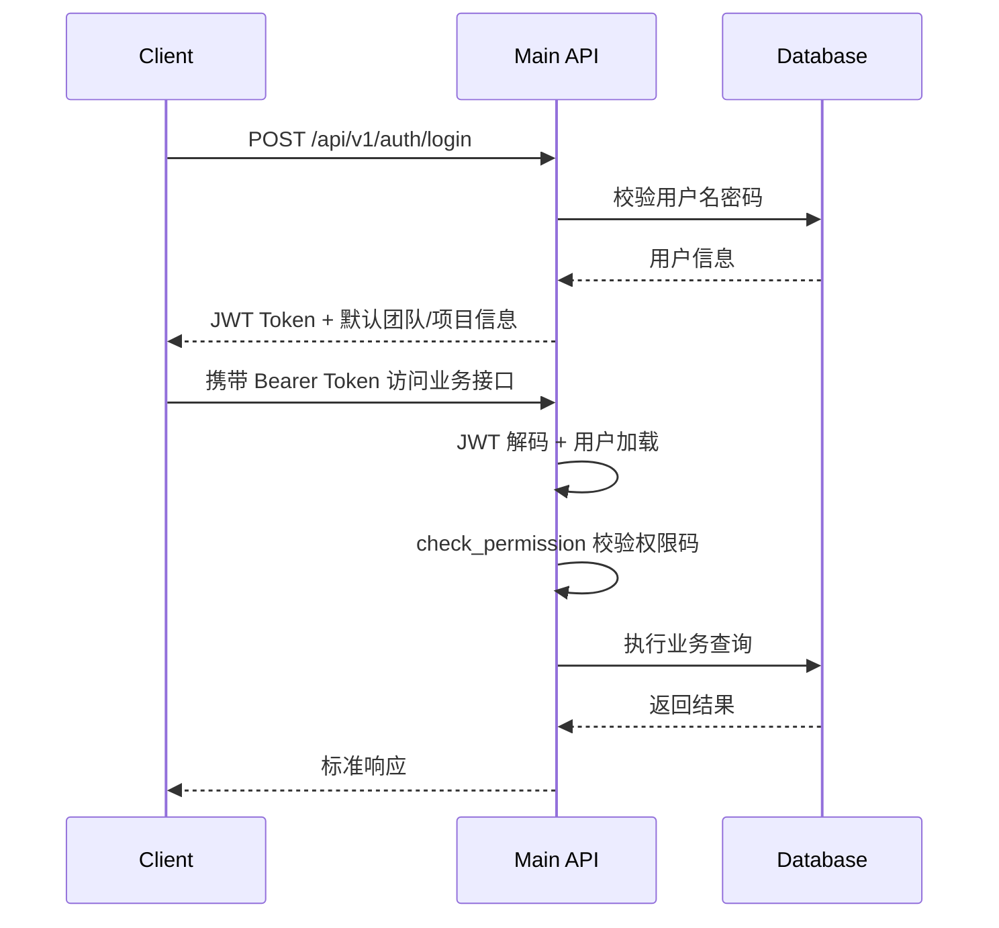
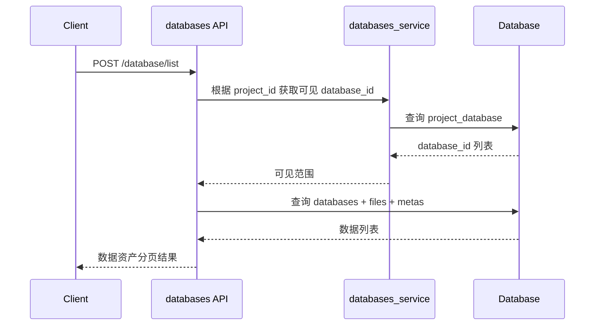
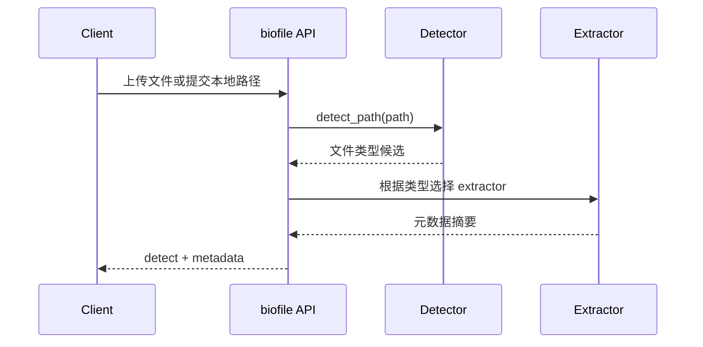

# FAN-CE 代码库整体设计文档

## 1. 文档目的

本文档基于当前仓库代码整理系统设计，回答两个问题：

1. 这个代码库主要做什么
2. 代码当前是如何组织和协作的

本文档关注的是“现状设计”，不是目标蓝图。结论以当前代码实现为准。

## 2. 仓库定位

`fan-ce` 是一个以 FastAPI 为核心的生物信息/农业科研数据平台型后端仓库，主目标不是单点算法服务，而是把以下能力放在同一套后端里：

- 系统级用户、团队、项目、角色、权限管理
- 数据资产管理，包括数据库记录、数据文件、增强元数据
- 样本、实验、基因集等科研对象管理
- 组学数据查询与生物文件解析
- 对外 AI 服务集成，包括 Dify 工作流代理和北向聊天代理
- 面向外部调用的 Python SDK 和 MCP Server

从代码结构看，这个仓库更接近“科研数据平台后端 + 组学能力服务 + 外部 AI 集成层”的组合，而不是单纯的算法 PoC。

## 3. 仓库级组成

仓库可以分成 4 个交付单元：

### 3.1 主后端服务

`backend/api-server/main.py` 启动主 FastAPI 应用，统一挂载两大 API 域：

- `apps/`：业务管理域
- `basis/`：组学与生物信息域

这是仓库的主应用。

### 3.2 Python SDK

`backend/sdk/` 提供 `abd_sdk`，用于外部 Python 程序调用主服务 API，封装认证、HTTP 调用、日志和模块化 API 客户端。

### 3.3 MCP Server

`backend/mcp/omics_server` 提供一个面向 MCP 工具生态的服务包装层，把部分组学查询能力暴露给 LLM Agent 或支持 MCP 的客户端。

### 3.4 文档与规范

- `docs/`：设计文档
- `openspec/`：变更规范与规格文件

## 4. 主系统职责

主系统的核心职责可以概括为一句话：

> 围绕团队和项目，管理科研数据对象，并提供对组学文件、基因组注释、实验元数据和外部 AI 能力的统一 API 访问入口。

从业务角度可以拆成 6 类能力：

### 4.1 系统管理

- 用户管理
- 角色与权限管理
- 菜单管理
- 团队管理
- 项目管理
- 字典和基础配置管理

### 4.2 数据资产管理

- 数据库记录管理
- 数据文件上传、挂接、下载
- 数据库与项目关联
- 数据增强元数据管理

### 4.3 科研对象管理

- 样本管理
- 实验管理
- 基因集管理

### 4.4 组学数据访问

- 基因组元数据管理
- 序列查询
- 特征区间查询
- 表达矩阵查询
- 变异查询
- 峰值区间查询
- 表型、种质、GRN 查询

### 4.5 生物文件解析

- 本地文件分析
- 上传文件分析
- 批量文件分析
- 文件类型识别与元数据抽取

### 4.6 外部 AI/平台集成

- Dify 工作流代理
- 北向聊天代理
- 基于认证密钥的免用户名密码登录

## 5. 整体架构

## 6. 启动与装配流程

主应用启动路径如下：

1. `backend/api-server/main.py` 创建 `FastAPI` 实例
2. 挂载静态目录 `/static` 和头像目录 `/api/v1/avatar`
3. 调用 `register_*` 系列方法完成装配
4. 注入 `apps` 与 `basis` 路由
5. 按配置决定是否初始化数据库和 Alembic 配置

### 6.1 关键装配点

- `backend/api-server/main.py`
- `backend/api-server/register/router.py`
- `backend/api-server/register/app_init.py`
- `backend/api-server/core/config.py`

### 6.2 配置方式

配置由 `core/config.py` 管理：

- 固定基础配置由 `Settings` 定义
- `APP_ENV` 决定加载 `conf/config.dev` 或 `conf/config.prod`
- `libs.hytconfig` 负责读取配置并形成 `app_options`
- 数据库类型通过 `database.type` 决定走 MySQL 还是 SQLite

## 7. 模块划分

## 7.1 `apps/` 业务管理域

`apps/routers.py` 聚合以下模块：

- `auth`：登录、菜单、认证密钥登录
- `databases`：数据资产、数据文件、元数据、项目关联
- `sample`：样本管理
- `experiment`：实验管理
- `platform`：平台信息管理
- `gene`：基因集管理
- `system`：用户、团队、项目、菜单、权限、角色、字典

### 7.1.1 认证与权限

系统采用三层组合：

- OAuth2 password login 获取 JWT
- `get_auth_user` 对 JWT 做用户识别
- `check_permission` 基于 RBAC 权限码做接口鉴权

同时新增了认证密钥体系：

- 为用户生成 `auth_key`
- 用 `auth_key` 直接换取 token
- 适合外部系统集成和服务调用

### 7.1.2 系统管理模型

系统管理围绕以下核心对象展开：

- `User`
- `Role`
- `Team`
- `Project`
- `Permission`
- `Menu`

其中团队和项目是业务数据的作用域边界，RBAC 信息同时存在系统角色和团队角色两套维度。

### 7.1.3 数据资产模型

数据资产模块核心表：

- `Databases`：逻辑上的数据集/数据库记录
- `DatabasesFile`：实际文件记录
- `DatabasesMeta`：数据库元数据
- `ProjectDatabasesLink`：项目和数据集关联

设计上，`Databases` 表示业务对象，`DatabasesFile` 表示文件落地，两者解耦后可支持：

- 文件先上传后绑定
- 一个项目关联多个数据库
- 基于项目范围筛选可见数据

### 7.1.4 科研对象模型

科研对象层目前主要包括：

- `Sample`
- `SampleMeta`
- `Experiment`
- `EnhancementMeta`
- `GeneSet`
- `GeneSetLink`

它们与项目/团队关系如下：

- 样本归属项目
- 实验通常归属样本
- 数据资产可关联项目
- 基因集记录带 `team_id` 和 `project_id`
- 基因集和基因组文件路径通过 `GeneSetLink` 建立关系

## 7.2 `basis/` 组学与生物信息域

`basis/routers.py` 聚合的能力明显偏向科研数据访问与解析：

- 基因组元数据
- 生物文件识别与分析
- NGS
- 序列查询
- 特征查询
- 表达查询
- 变异查询
- 峰值查询
- 表型查询
- 种质资源查询
- 基因调控网络查询
- 基因/转录本/特征查询

### 7.2.1 典型能力模型

#### 基于文件路径的查询

多个接口直接围绕本地文件路径工作，例如：

- 读取 fasta / gff / expression / vcf 等文件
- 建索引后按区间、基因、样本查询

这意味着 `basis` 很大程度上是“面向数据盘文件的计算型 API 层”，而不是单纯依赖数据库存储全部科学数据。

#### 生物文件识别与元数据提取

`basis/api/biofile.py` + `basis/core/biofile/` 实现了：

- 文件类型识别
- 批量上传文件分析
- sidecar 文件关联识别
- 根据文件类型分发到不同 extractor

这是仓库中比较独立、可复用的一块能力，可视为“生物文件智能识别子系统”。

### 7.2.2 `basis` 的价值定位

如果说 `apps` 是业务管理层，那么 `basis` 更像科研计算访问层：

- `apps` 管“谁、在哪个团队、哪个项目、有权看哪些对象”
- `basis` 管“如何对组学数据和生物文件做查询、解析、检索和分析”

两者共同构成平台后端。

## 7.3 `backend/sdk/` Python SDK

`backend/sdk/abd_sdk` 是对主 API 的客户端封装，目标用户是：

- Python 脚本
- 自动化任务
- 第三方系统集成
- 研究人员本地调用

设计职责包括：

- 统一认证
- HTTP 请求封装
- 模块化 API 客户端
- 配置和日志管理

它说明仓库作者不仅考虑“服务端”，也考虑“可被程序消费”的接入方式。

## 7.4 `backend/mcp/` MCP Server

`backend/mcp/omics_server` 将部分平台能力封装为 MCP Tool，典型工具包括：

- `get_data_list`
- `search_genes`
- `get_gene_info`
- `get_transcript_info`
- `get_genomic_sequence`
- `custom_api_call`

这层的定位不是替代主服务，而是把主服务的一部分能力重新包装成面向 Agent 的工具协议接口。

这使得代码库具备“给人用的 API”和“给智能体用的工具接口”两种输出形态。

## 8. 核心数据关系

下面是根据当前模型抽象出的主要业务关系：

## 9. 典型请求流

### 9.1 平台内登录与鉴权流

### 9.2 数据资产查询流

### 9.3 生物文件分析流

## 10. 分层设计

虽然代码没有严格 DDD 或 clean architecture 边界，但总体上可以识别出以下层次：

### 10.1 接口层

- `apps/*/api/*.py`
- `basis/api/*.py`
- `apps/*/routers.py`
- `basis/routers.py`

职责：

- 定义 HTTP 路由
- 做请求参数接收
- 拼装响应
- 注入依赖和权限校验

### 10.2 业务服务层

- `apps/services/*`
- `basis/core/*`

职责：

- 跨表组合逻辑
- 文件解析、索引、查询等业务逻辑

### 10.3 数据访问层

- `apps/*/crud.py`
- `db/*`

职责：

- ORM 会话管理
- 通用 CRUD
- MySQL / SQLite 切换

### 10.4 模型与协议层

- `models.py`
- `schemas.py`

职责：

- ORM 表结构
- Pydantic 请求响应模型

### 10.5 通用基础设施层

- `core/`
- `register/`
- `libs/`
- `utils/`

职责：

- 配置
- 中间件
- 异常
- 响应封装
- 日志
- 文件与 HTTP 工具

## 11. 技术选型

当前主要技术栈如下：

- Web 框架：FastAPI
- ASGI 服务：Uvicorn
- ORM：SQLAlchemy
- 配置：Pydantic Settings + 自定义配置注册器
- 鉴权：OAuth2 Password + JWT
- 数据库：MySQL / SQLite 二选一
- 文件与数据处理：pandas、openpyxl、h5py、pysam、gffutils、networkx
- 外部 HTTP：httpx、requests
- AI 集成：自定义 MCP

## 12. 当前设计特征

### 12.1 单体应用，多域聚合

主服务是一个单体 FastAPI 应用，但内部已经自然分化为多个业务域和技术域，属于“模块化单体”风格。

### 12.2 业务对象和科研对象混合在同一后端

同一个服务既承担后台管理，又承担组学文件查询与分析，运维上简化了部署，但边界也更容易变宽。

### 12.3 强文件系统依赖

`basis` 很多能力不是围绕数据库表，而是围绕本地数据盘路径和索引文件工作。这符合组学场景，但要求部署环境具备稳定的数据盘结构。

### 12.4 权限模型以团队/项目为范围边界

平台数据访问不是纯全局权限，而是基于团队和项目组织数据对象，再叠加 RBAC 权限码控制操作能力。

## 13. 现状问题与设计风险

以下问题是从代码现状直接观察到的，不是理论推测：

### 13.1 命名风格不一致

例如删除标记字段同时出现：

- `is_delete`
- `is_deleted`

这会增加通用 CRUD 和筛选逻辑的维护成本。

### 13.2 模块边界偏宽

一个应用里同时承载系统管理、科研资产、文件解析和对外协议包装，后续继续扩展时容易让单体进一步膨胀。

### 13.3 部分装配点尚未实装

例如 `register/app.py` 中的 `register_app()` 当前基本为空，说明多子应用挂载设计存在预留但未真正落地。

## 14. 适合的演进方向

如果继续演进，这个仓库比较适合沿以下方向优化：

1. 收敛配置来源，彻底移除默认密钥和 mock 配置
2. 明确 `apps` 和 `basis` 的边界，减少跨域耦合
3. 统一软删除和状态字段命名
4. 为关键流程补齐集成测试，尤其是鉴权和文件分析链路

## 15. 结论

这个代码库主要实现的是一个面向农业/生物信息场景的数据平台后端：

- 用 `apps/` 管理人、团队、项目、数据资产和科研对象
- 用 `basis/` 提供组学查询和生物文件分析能力
- 用 `backend/sdk/` 和 `backend/mcp/` 把能力输出给程序和智能体

从设计角度看，它已经不是简单 PoC，而是一个具备平台雏形的模块化单体系统。
